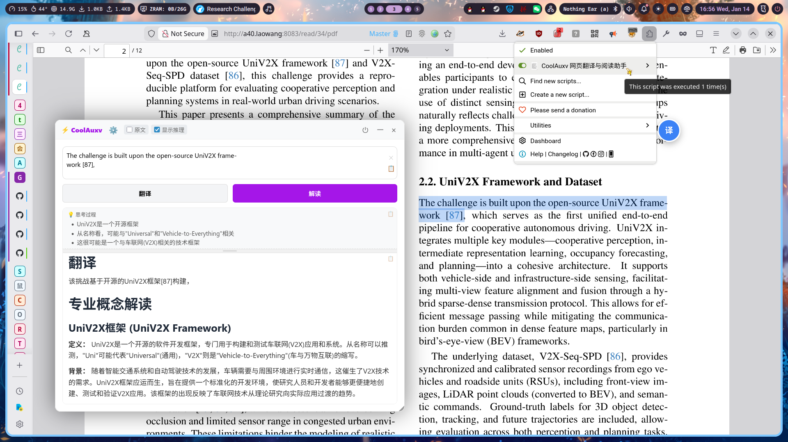

# CoolAuxv

**沉浸式网页翻译与深度解读工具 | 支持 GLM-4 等推理模型**

# [👉👉👉 TRY NOW 👈👈👈](https://github.com/CoolestEnoch/CoolAuxv/raw/refs/heads/main/translator.user.js)

## 📖 脚本简介

**CoolAuxv** 是一个强大的油猴（Tampermonkey）脚本，旨在方便阅读陌生的文献。

它是一个**由大模型强力驱动**的翻译工具，完美支持 **GLM-4.5-Flash** 等推理模型，能够可视化 AI 的“思考过程”。

## 📲 支持Android端使用！！！

## ✨ 核心功能

### 1. 🌊 极速流式响应 (Streaming)
拒绝转圈等待！基于 Server-Sent Events (SSE) 技术，翻译结果实时逐字显示，体验丝滑流畅，长文本也能即刻响应。

### 2. 📚 翻译 & 解读双模式
*   **翻译模式**：中外互译。
*   **解读模式**：**深度剖析**、背景解释及专业术语标注，适合学术阅读和深度学习。

### 3. 🖥️ 一键识屏
*   **点击就识**：点击识屏按钮立刻识屏，然后马上开始分析。
*   **深度理解**：**推理模型加持**，深度解读图片秘密。
*   **交互友好**：现代化的交互逻辑，就和Windows截图一样简单。

### 3. 🎨 极简主义：现代化的 UI/UX
*   **Markdown 渲染**：支持代码高亮、列表、粗体、公式等丰富格式。
*   **自由拖拽**：窗口大小自由调整，位置随心拖拽。
*   **流体玻璃**：高斯模糊加持，只为还原最真实的玻璃体验。
*   **配置面板**：
    *   模型分栏显示（语言模型/推理模型），并标注免费/付费状态。
    *   直观的提示词设置界面。

### 4. 🧠 推理模型完美支持 (Reasoning)
*   **思考过程可视化**：完整展示 AI 的推理步骤（Chain of Thought）。
*   **智能交互**：
    *   检测到推理内容时，思考框**自动展开**。
    *   推理结束开始输出正文时，思考框**自动收起**，让您专注于结果，同时不错过思维细节。
    *   高度自适应：拖拽调节思考框高度，重启后自动复位。

## 🛠️ 使用指南

1.  **安装插件**：
    *   **PC端**：Chrome/Edge 安装 Tampermonkey 扩展。
    *   **Android端**：推荐安装 **Firefox for Android** 浏览器，并在其附加组件中安装 Tampermonkey, 然后将脚本内容完整粘帖进TamperMonkey。
2.  **获取 Key**：前往 [智谱 AI 开放平台](https://bigmodel.cn/usercenter/proj-mgmt/apikeys) 获取 API Key。
3.  **配置**：
    *   选中网页任意文本 -> 点击出现的 **"译"** 图标。
    *   点击右上角 **⚙️ 设置** 图标，填入 API Key 并保存。
4.  **开始使用**：
    *   点击 **"翻译"** 或 **"解读"** 按钮即可。
    *   双击设置界面的模型按钮可快速切换模型。

## ⚙️ 个性化设置

*   **自定义提示词**：您可以为“翻译”和“解读”分别设置专属的 System Prompt。
*   **窗口记忆**：插件会记住您上次调整的窗口大小。
*   **日志调试**：遇到问题？在设置中开启 `Debug` 模式查看详细日志。

## 🔗 开源地址

本项目完全开源，欢迎 Star 或提交 Issue：
👉 [https://github.com/CoolestEnoch/CoolAuxv](https://github.com/CoolestEnoch/CoolAuxv)
