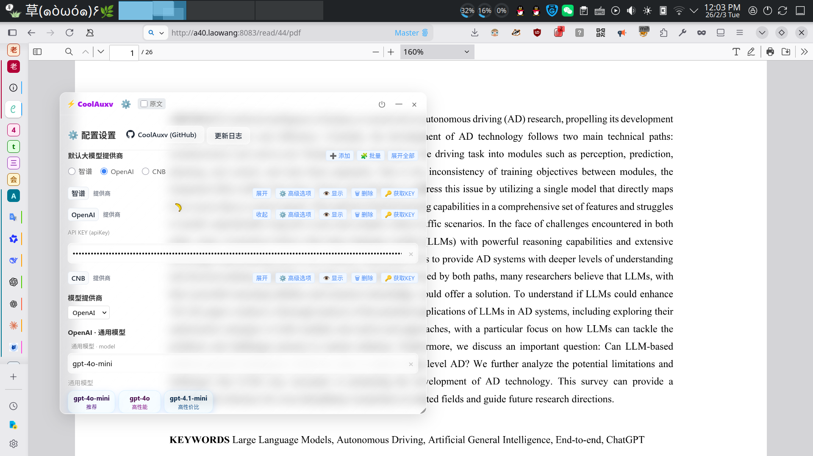
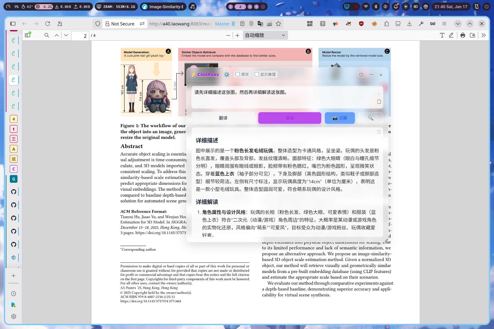
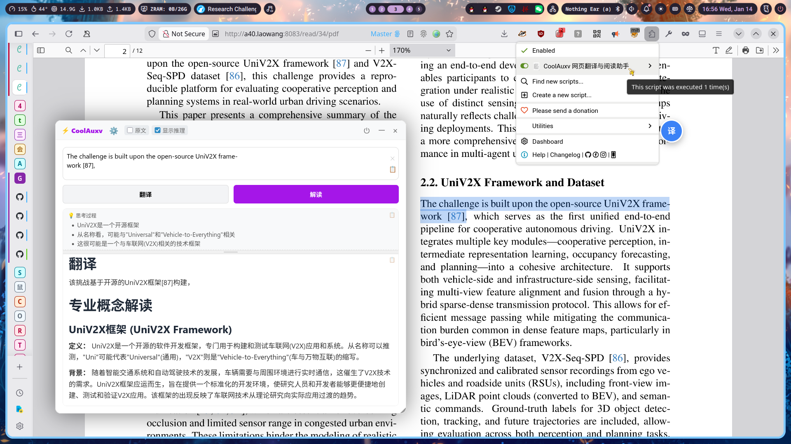
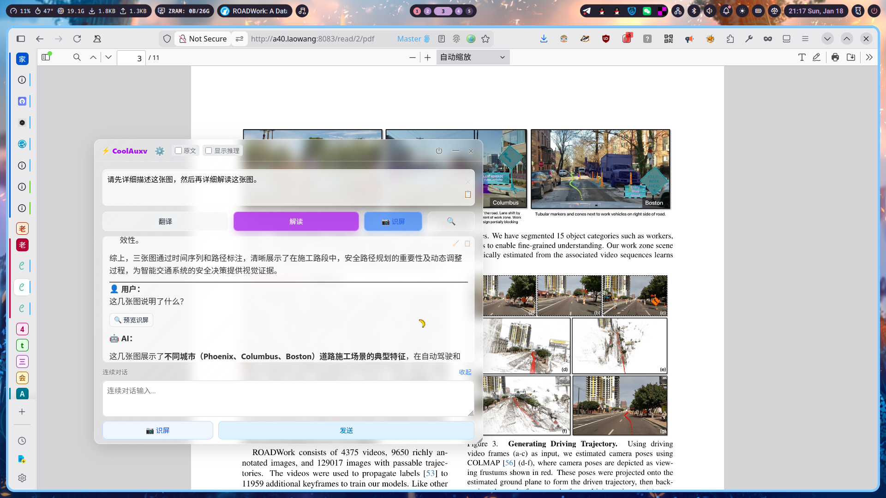
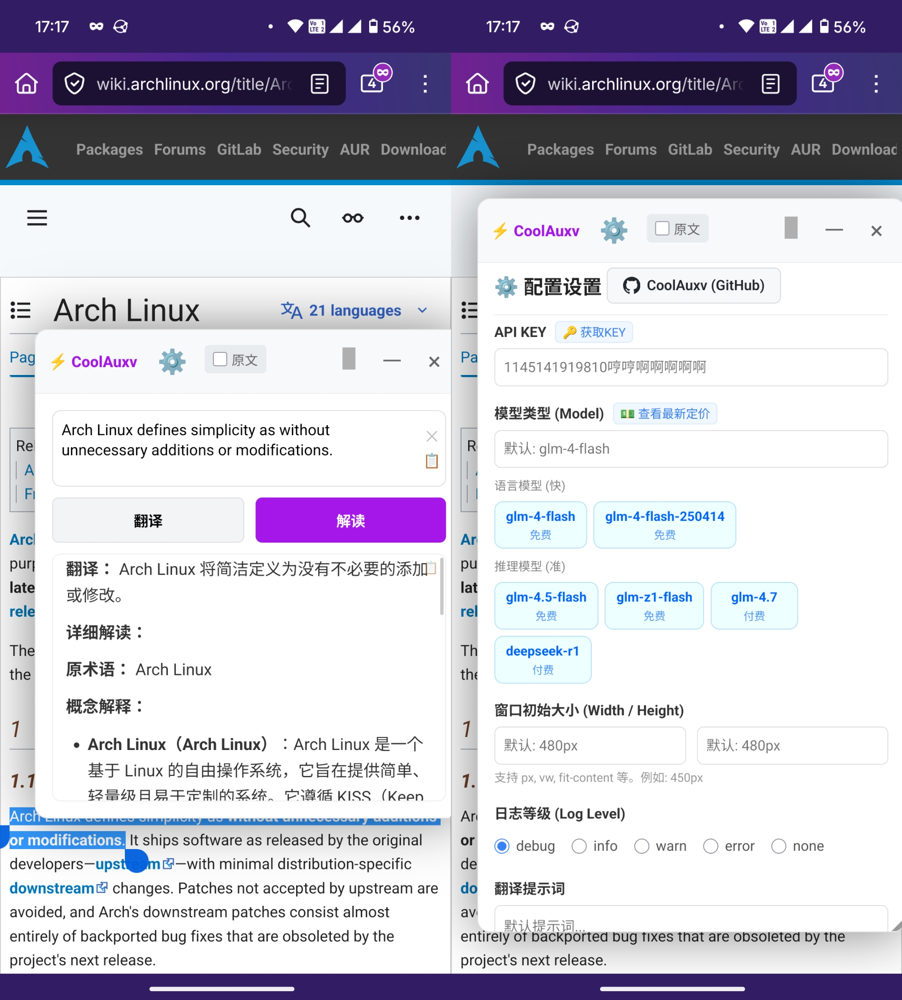

# CoolAuxv

**网页翻译与深度解读工具 | 支持 `GLM-4` `GPT-4o-mini` 等推理模型**

**已支持 Chromium 类浏览器扩展版（Load unpacked 安装），已支持OpenAI接口**

# [👉👉👉 立即安装 / INSTALL 👈👈👈](https://github.com/CoolestEnoch/CoolAuxv/raw/refs/heads/main/translator.user.js)

## 📖 简介

**CoolAuxv** 是一款基于油猴（Tampermonkey）的网页辅助脚本。

对接了智谱和OpenAI的大语言模型，主要用于辅助阅读外文文献。除了基础的翻译功能外，它利用大模型的推理能力，提供对专业术语、复杂长难句的深度解读和背景分析。

## 完美兼容 Android 系统！！！
脚本适配了移动端浏览器的触控操作（推荐使用 Firefox for Android 或 IronFox）。
*   支持触摸拖拽选区。
*   界面自适应手机屏幕宽度。

---

## 💻 功能特性

### 1. 深度阅读辅助
*   **翻译模式**：基础的中外互译功能。
*   **解读模式**：不仅翻译，还会对文本中的专业概念进行展开解释，适合学术和专业场景。
*   **推理可视化**：支持显示推理模型（Reasoning Models）的思维链（Chain of Thought），思考过程可见。

### 2. 连续对话
*   **多轮上下文**：在阅读时直接进行多轮对话，自动继承已有翻译/解读/识屏内容。
*   **图文混合**：支持识屏图片参与对话，并提供预览与清除操作。

### 3. 屏幕视觉分析
*   **一键识屏**：支持截取网页特定区域（如图表、公式）并发送给多模态大模型进行分析。
*   **选区交互**：提供类似系统截图的框选体验，支持空格/回车快捷键确认。
*   **滚动修正**：针对长网页滚动后的截图偏移问题，提供了实验性的修正算法（需在设置中开启）。

### 4. PDF 阅读
*   **在线链接打开**：支持输入在线 PDF 地址并直接在 PDF.js 中打开。
*   **本地文件加载**：可将本地 PDF 通过内存传输到 PDF.js 打开，不消耗流量。

### 5. 渲染与排版
*   **Markdown 支持**：支持渲染代码块、粗体、列表等格式。
*   **公式渲染**：内置 KaTeX 引擎，可正确显示 LaTeX 数学公式和矩阵。
*   **流体玻璃 UI**：提供可选的界面美化设置，开启后主窗口和控件背景将应用高斯模糊效果。

### 6. 配置管理
*   **一键导出/恢复**：支持配置导出为纯 Base64 文本，方便备份与迁移。
*   **跨版本互导**：油猴版与 Chromium 类浏览器扩展版均支持导入/导出，可手动互导配置。

### 7. 多服务商
*   **不同服务商**：支持使用智谱或OpenAI作为服务商，需自备API KEY。
*   **跨服务器连续对话**：不同服务商的不同模型可共享同一组聊天记录，聊天更顺畅。

---

## 🛠️ 使用说明

1.  **安装（油猴版）**：
    *   PC 端：Chromium 类浏览器安装 Tampermonkey 扩展。
    *   Android 端：Firefox 安装 Tampermonkey 扩展。
    *   点击 **[这里](https://github.com/CoolestEnoch/CoolAuxv/raw/refs/heads/main/translator.user.js)** 安装脚本。
2.  **安装（Chromium 类浏览器扩展版）**：
    *   下载或克隆本仓库代码。
    *   打开扩展管理页并启用开发者模式。
    *   点击 “Load unpacked”，选择仓库中的 `chrome_ext` 目录。
3.  **配置 Key**：
    *   脚本使用智谱 AI 的 API，需自行前往 [智谱开放平台](https://bigmodel.cn/usercenter/proj-mgmt/apikeys) 申请 API Key。
    *   在网页选中文本 -> 点击“译”图标 -> 进入设置 -> 填入 Key。
3.  **操作**：
    *   **文本分析**：划选网页文本后点击悬浮图标。
    *   **图片分析**：点击面板上的“📷 识屏”按钮进行截图。
    *   **连续对话**：在设置中启用“连续对话”，然后在面板底部输入并发送。
    *   **PDF 阅读**：在设置页的“PDF 阅读工具”中输入链接或选择本地文件。

## ⚙️ 常见问题 (Q&A)

*   **Q: 截图时选区位置不对，或者截取的是页面顶部的内容？**
    *   A: 这是由于浏览器滚动造成的坐标偏移。请进入脚本设置，在“实验性功能”中勾选 **“使用新截屏算法”**，该模式会先冻结全屏再裁切，可解决此问题。
*   **Q: 公式显示为乱码或代码？**
    *   A: 请确保网络能正常加载 KaTeX 资源文件（脚本会自动引入 CDN 资源）。
*   **Q: 界面背景是纯白色的？**
    *   A: 默认关闭特效。如需磨砂效果，请在设置中勾选 **“开启窗口流体玻璃 (Blur Glass)”**。
*   **Q: 连续对话在哪里打开？**
    *   A: 进入设置页，在“实验性功能”里勾选 **“连续对话”**，回到主界面即可看到对话区。

## 🔗 开源协议

本项目遵循 GPL-3.0 协议开源。
👉 [https://github.com/CoolestEnoch/CoolAuxv](https://github.com/CoolestEnoch/CoolAuxv)

---

## 📎 第三方依赖许可证声明

本项目在运行时或随包分发中使用了以下开源依赖，其许可证分别适用：

- Marked (MIT): https://github.com/markedjs/marked/blob/master/LICENSE.md
- html2canvas (MIT): https://github.com/niklasvh/html2canvas/blob/master/LICENSE
- KaTeX (MIT): https://github.com/KaTeX/KaTeX/blob/master/LICENSE
- PDF.js (Apache-2.0): https://github.com/mozilla/pdf.js/blob/master/LICENSE
